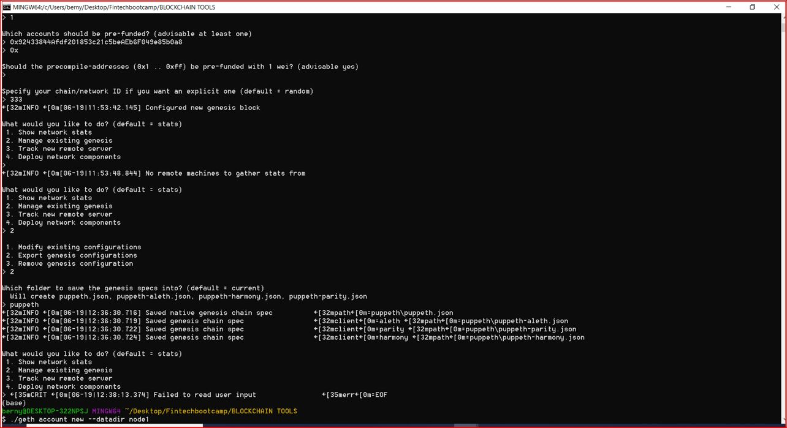
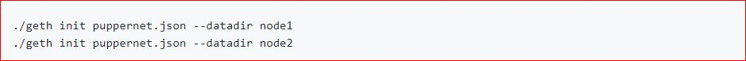

# Blockchain-Building-Blocks-Homework

Homework Objective: As a role of a new developer at a small bank. My mission is to set up a testnet blockchain for an organization.

Below are the four deliverables:

* 1 - Set up your custom testnet blockchain.

* 2- Send a test transaction.

* 3 - Create a repository.

* 4 - Write instructions on how to use the chain for the rest of your team.

## Ethereum network setup steps
Visit to https://geth.ethereum.org/downloads/ and download the latest version of Geth & Tools.

Extract the downloaded zipped folder and copy the contents of the folder to a desired working folder.

Open terminal and browse to the working folder with the geth & tools.

Create accounts for two nodes for the network with a separate datadir for each.

Run puppeth, name the network puppernet, and select the option to configure a new genesis block. Follow the same steps as below.

Chain/Network Id is set to 888
Block time is set to the default 15 seconds.
Block time explained: https://medium.facilelogin.com/the-mystery-behind-block-time-63351e35603a
With the genesis block creation completed, we will now initialize the nodes with the genesis' json file.

Using geth, initialize each node with the new puppernet.json.

Now the nodes can be used to begin mining blocks.

Run the nodes in separate terminal windows with the commands:

##Node 1:

##Node 2 in a separate terminal window:

The --rpc flag enables us to talk to our second node, which will allow us to use MyCrypto or Metamask to transact on our chain.

Since the first node's sync port already took up 30303, we need to change this one to 30304 using --port.

The --bootnodes flag allows you to pass the network info needed to find other nodes in the blockchain. This will allow us to connect both of our nodes.

In Microsoft Windows, we need to add the flag --ipcdisable due to the way Windows spawns new IPC/Unix sockets doesn't allow for having multiple sockets running from geth at once. Since we are only using RCP we can safely disable the IPC sockets.

##My Crypto
-Set up My Crypto (Using Mnemonic Phrase)
-Use Your Private Key 

-Keystore file in each node is avaialble Eg: below

Set up a Custom Node

Since this was set up before puppeth is running on the background and an illustration of what you see is below of the transaction:

-You can watch your Transaction fee and check balance on your wallet

##Result

